# **-----**

## Comando `git`
~~~
git
~~~
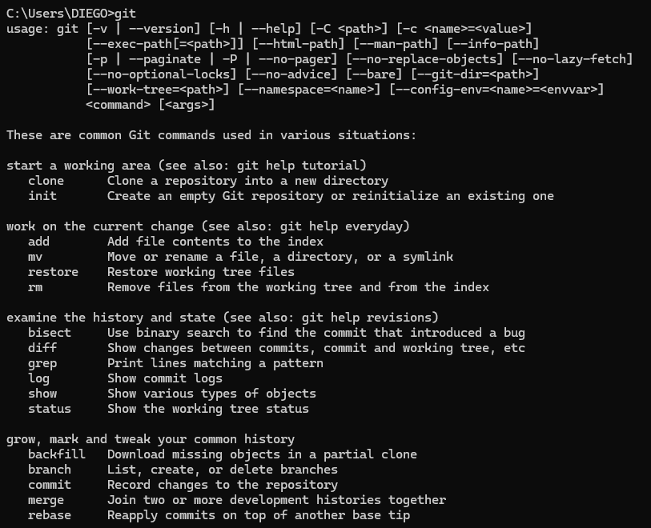

Usamos el comando `git` para verificar la correcta instalación del Git en nuestro dispositivo y como no usamos ningún comando git, nos muestra todos los comandos con una breve decripción para tener más ayuda.

## Comando `version`
~~~
git --version
git -v
~~~
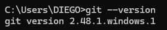

Este es el primer comando que usamos usualmente y es para comprobar la versión de git que tenemos instalada.

## Comando `help`
~~~
git --help
git -h
~~~
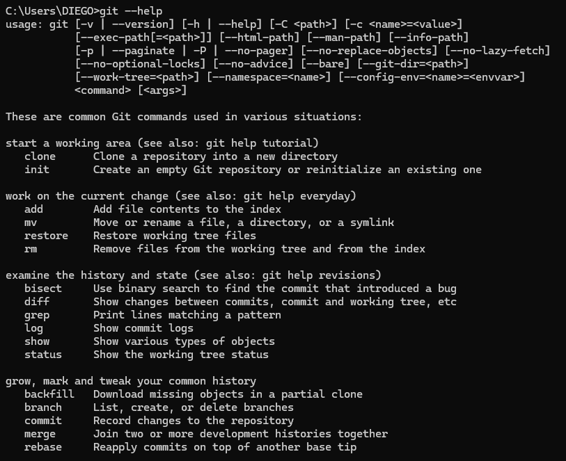

Este comando lo usamos para pedir ayuda de todos los comandos que tenemos disponibles en git.

# **-----**

## Comando `ls`
~~~
dir
~~~
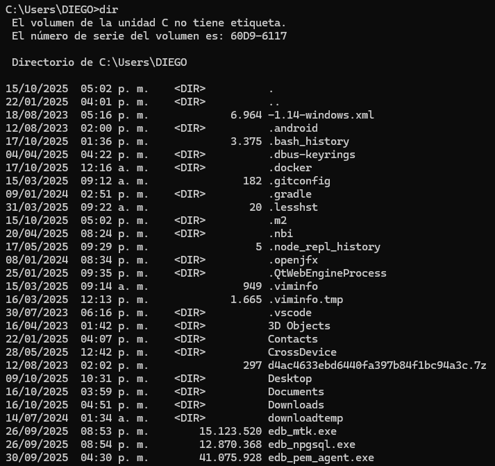

En esta imagen vemos el comando `dir`, pero es porque `ls` es un comando de UNIX, no de Windows, si llegamos a inicializar nuestro git si podemos usar el comando `ls` y la función de este comando es listar todas las carpetas disponibles.

## Comando `cd`
~~~
cd Desktop
~~~
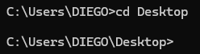

El comando cd si existe en Windows y sirve para movernos entre las carpetas que tenemos en nuestro dispositivo.
Por ejemplo, me quise mover a la carpeta 'Desktop' (Escritorio) y solo con escribir 'Des' y pulsar TAB la terminal nos autocompleta el nombre.

~~~
cd .
cd ..
~~~
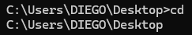

El comando `cd .` nos sirve para salirnos de una carpeta, el `cd ..` si sirve para volver a la carpeta inicial.

## Comando `pwd`
~~~
cd
~~~
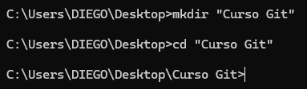

En Windows para conocer la carpeta en la que nos encontramos es unicamente poniendo `cd`.

## Comando `mkdir`
~~~
mkdir "Curso Git"
cd "Curso Git"
~~~

Este comando lo usamos para crear una carpeta, en la imagen vemos como creamos la carpeta "Curso Git" y entramos a ella.

## Comando `code .`
~~~
code .
~~~
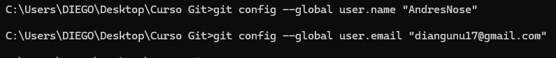

Este comando lo usamos para abrir el Visual Studio Code en la carpeta en la que nos encontramos, en este caso en "Curso Git".

# **-----**

## Comando `git config --global`
~~~
git config --global user.name "AndresNose"
git config --global user.email "diangunu17@gmail.com"
~~~
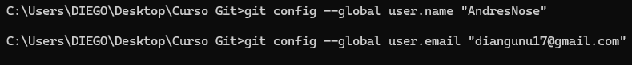

Este comando lo usamos para establecer el nivel en el cual vamos a hacer las configuraciones, que en este caso son globales.
Y las configuraciones que establecemos son el usuario y el correo, que esto es esencial para empezar a trabajar en git.

# **-----**

## Comando `git init`
~~~
git init
~~~
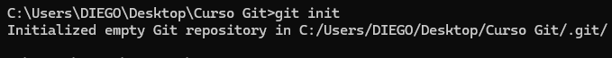

Este comando lo usamos para empezar a usar git en la carpeta en la que vayamos a trabajar, en esta ocasión seguiremos trabajando en nuestra carpeta "Curso Git".

# **-----**

## Comando `git branch -m main`
~~~
git branch -m main
~~~
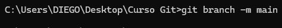

Este comando lo usamos para renombrar una rama, en este caso tenemos la rama por defecto master y la renombramos a main.

# **-----**

## Comando `git status`
~~~
git status
~~~
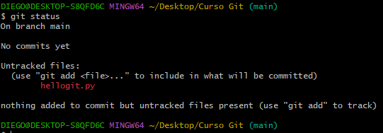

Este comando lo usamos para ver el estado de nuestra rama, y en esta situación nos dice que todavía no hay commits.
Y aparte, se menciona como el archivo hellogit.py no se ha subido.

## Comando `git add`
~~~
git add hellogit.py
~~~

Con este comando subimos nuestro archivo y nos deja de aparecer el error.

# **-----**
~~~
git commit -m "Primer commit"
~~~
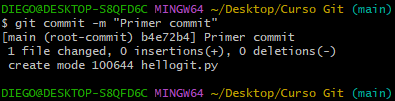

Si usamos únicamente git commit se nos abrirá un editor de texto para introducir el comentario, con el uso de -m podemos introducir nuestro comentario sin necesidad de abrir el otro editor de texto.
Y ahora al momento de usar el git status nos saldrá que ya hay un commit hecho.

# **-----**

## Comando `git log`
~~~
git log
~~~
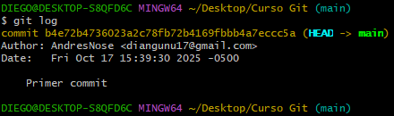

Con este comando vemos todos los registros de los commits hechos.

Y mediante el uso de git add y git branch para añadir nuevos archivos y crear nuevas ramas podemos volver a mirar el registro y ahí estará la información de los commits.

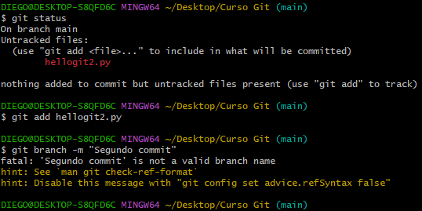

# **-----**

## Comando `git checkout`
~~~
git checkout hellogit.py
~~~
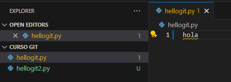

Acá vemos un texto sin editar dentro del archivo, y en la siguiente imagen se ha retrocedido a la última versión guardada.
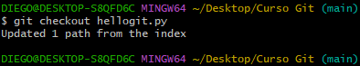

Y después de ejecutar este comando, retrocederemos a la última versión del archivo en la que estabamos.
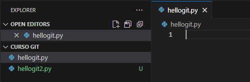

Con este comando, podemos retroceder a versiones anteriores de un archivo

## Comando `git reset`
~~~
git reset
~~~

Con este comando vemos todos los registros de los commits hechos.

## Comando `git log`
~~~
git log --graph --pretty=oneline
~~~
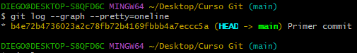

Por ejemplo, hay distintas formas de manejar la forma en la que se muestran los logs, como por ejemplo, que ocupen 1 sola linea o cambiar el orden en el que se muestran.

# **-----**

## Comando `git alias`
~~~
git config --global alias.logbonito "log --graph --pretty=oneline"
~~~
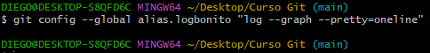

Este comando funciona para nombrar y almacenar ciertos comandos, como por ejemplo el log que modificamos anteriormente:

~~~
git logbonito
~~~
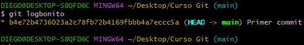

# **-----**

## Comando `git ignore`
~~~
echo **/.archivo .gitignore
~~~

Acá estamos creando un archivo .gitignore para ignorar una carpeta al momento de consultar el estado del repositorio, como en este caso no queremos ignorar ningún archivo, simplemente no hay ninguna evidencia.
Y por último, se sube este archivo y se crea un nuevo commit.

# **-----**

## Comando `git diff`
~~~
git diff
~~~
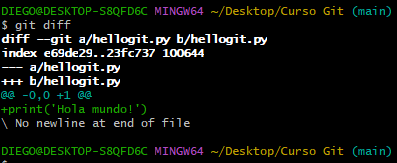

Con este comando logramos ver a detalle los cambios que se han hecho desde el último commit, mostrándonos la línea que se ha quitado y la que se ha añadido.

# **-----**

## Comando `git reset --hard`
~~~
git reset --hard
~~~
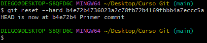

Con este comando retrocedemos a otro commit y eliminamos los posteriores a ese.

## Comando `git reflog`
~~~
git reflog
~~~
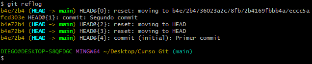

Con este comando vemos un registro de todos los cambios que hemos hecho en nuestro repositorio.

Y mediante el uso de `git reset --hard` podemos volver a algun commit eliminado.

# **-----**

## Comando `git tag`
~~~
git tag name
~~~
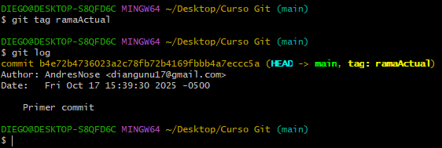

Con este comando asignamos una etiqueata a un commit en el que nos encontramos, esto sirve para llamarlo sin el identificador sino con la etiqueta dada.
Usando únicamente `git tag`, nos mostrará todas las etiquetas que tenemos creadas.

# **-----**

## Comando `git branch `
~~~
git branch name
~~~
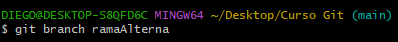

Con este comando creamos una nueva rama y le asignamos un nombre, para movernos a esta rama, lo veremos con el siguiente comando.

# **-----**

## Comando `git switch`
~~~
git switch name
~~~
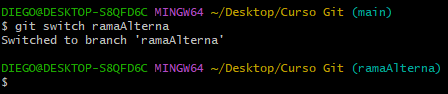

Con este comando nos cambiamos a alguna de las ramas alternas que tengamos creadas.

# **-----**

## Comando `git merge`
~~~
git merge
~~~
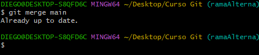

Este comando nos sirve para combinar cambios de ramas, combinando la rama actual con alguna otra rama.

## Resolución de conflictos
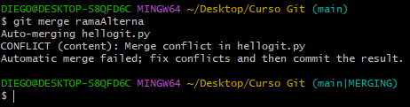

Acá hemos hecho cambios en ambas ramas y al momento de intentar combinarlas se nos presenta un error ya que han habido cambios en la misma linea.
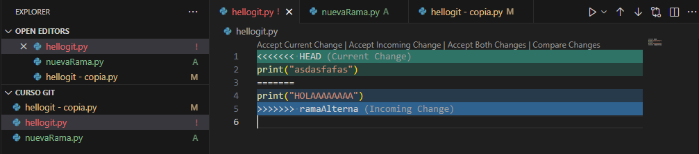

En el archivo de código nos muestran la misma linea y nos dice que escojamos cuál es la correcta para dejarla en el código.

# **-----**

## Introducción a Github
Para empezar en GitHub, debemos tener creada nuestra cuenta.
Una vez creada la cuenta, podemos empezar a crear un repositorio ingresando a nuestro perfil y en el apartado de repositorios le damos a "New".

Y por último le damos a "Create repository" para crear un repositorio.

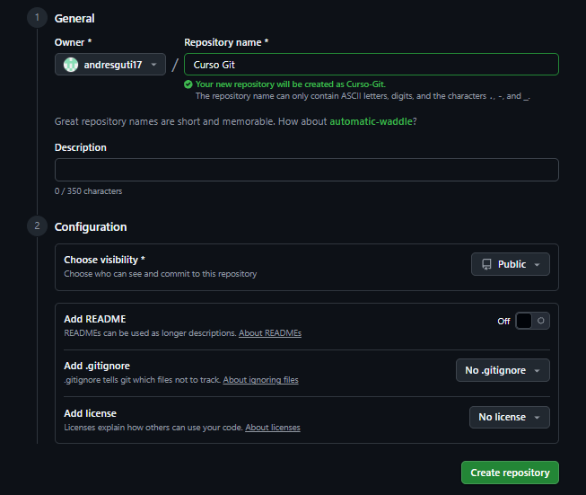

Incluso, al momento de crear el repositorio se nos dan indicaciones claras para subir los archivos.

## Comando `git remote`
~~~
git remote add origin https://github.com/andresguti17/Curso-Git.git
~~~
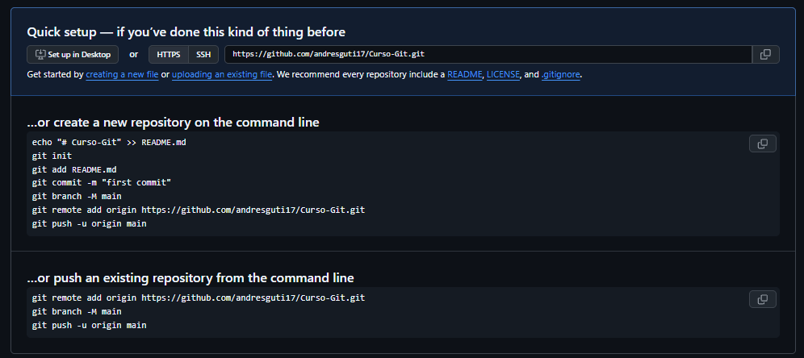
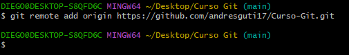

Con este comando conectamos el repositorio local de git con el repositorio en la nube de GitHub.

## Comando `git remote`
Y como acto siguiente, tenemos que subir todos los archivos que tenemos en nuestro repositorio local con el siguiente comando:
~~~
git push -u origin main
~~~

Y con esto, damos por concluido el curso, esto es todo lo que necesitamos saber sobre Git y GitHub.